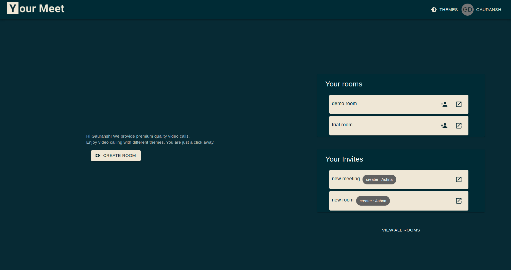
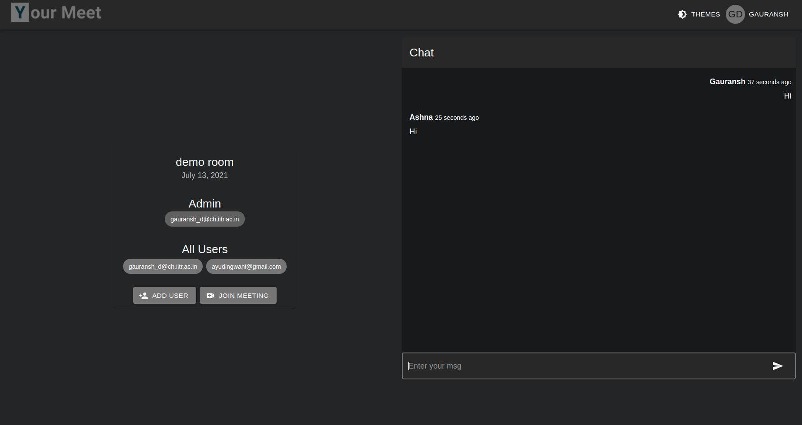
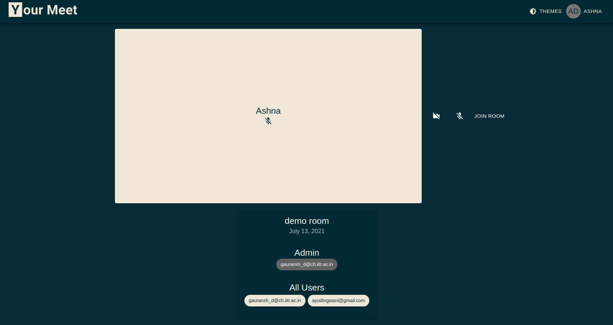
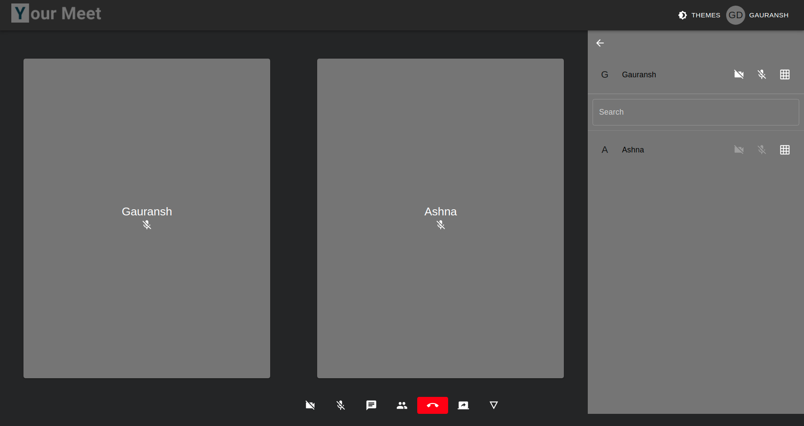
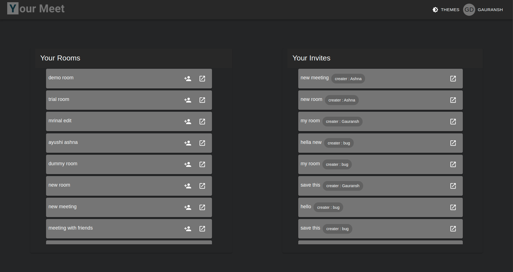

<!-- # Welcome to Mihir's Video Chat App ✨ -->
 

  

  <h3 align="center">Your Meet</h3>

  

    One platform to manage all your meetings!
     
    <a href="https://www.yourmeet.tech"><strong>Live »</strong></a>
     
     
    <a href="#">Video Demo</a>
  

## Tech Stack 💻

- Backend: [Django](https://www.djangoproject.com), with [DjangoREST](https://www.django-rest-framework.org) for APIs, and [Django Channels](https://channels.readthedocs.io/en/latest/) for managing WebSockets.

- Frontend: [React](https://reactjs.org/), with [Material-UI](https://material-ui.com/) and [Redux](https://react-redux.js.org/) for state management.

- Frontend build files are served with [NGINX](https://www.nginx.com/), with proxy_pass for requests to the backend.

- Gunicorn and Daphne servers for handling backend

- Containerized using [Docker](https://www.docker.com/), with [docker-compose](https://docs.docker.com/compose/) for container orchestration.

- Hosted on a [Amazon EC2 instance](https://aws.amazon.com/free/?all-free-tier.sort-by=item.additionalFields.SortRank&all-free-tier.sort-order=asc&awsf.Free%20Tier%20Categories=categories%23compute&trk=ps_a134p000006gEZ8AAM&trkCampaign=acq_paid_search_brand&sc_channel=PS&sc_campaign=acquisition_IN&sc_publisher=Google&sc_category=Cloud%20Computing&sc_country=IN&sc_geo=APAC&sc_outcome=acq&sc_detail=amazon%20ec2&sc_content=EC2_e&sc_matchtype=e&sc_segment=476942909971&sc_medium=ACQ-P|PS-GO|Brand|Desktop|SU|Cloud%20Computing|EC2|IN|EN|Text&s_kwcid=AL!4422!3!476942909971!e!!g!!amazon%20ec2&ef_id=CjwKCAjw87SHBhBiEiwAukSeUb771ycRy-8SYD9vyl6D55rWhRKzOpTwrfbturzZdaUqx6F14oxoohoC0VcQAvD_BwE:G:s&s_kwcid=AL!4422!3!476942909971!e!!g!!amazon%20ec2&awsf.Free%20Tier%20Types=*all)

## Features and Functionalities 😃

- Responsive website
- Five different themes
- Social Authentication with Google and Facebook
- Create meeting room
    - Start a meeting
    - Start a conversation
    - Save room for later
- Invite users in your meeting directly with email or share the url
- Dashboard to view all created rooms and invites
- Waiting Lobby to adjust video audio before joining the meeting
- Accept/Reject users joining your meet
- Share Screen
- View Meeting Details and add user from inside the meeting 
- Chat in real-time
- Manage the users you want to view during meet(Hide/show in grid)
- Continue Chat after the meeting ends
- Unlimited duration calls
- Simple and intuitive UI

## Screenshots 📸

### Home Page

### Chat Room

### Waiting Lobby

### Video Call

### All Rooms

## Show your support. Give a ⭐ if you like this repo.
## Made with ❤️ by [Gauransh](https://gauransh7.github.io)